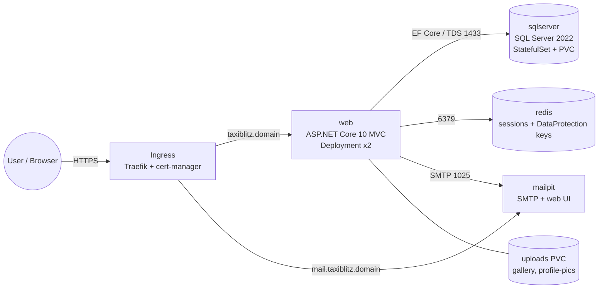

# TaxiBlitz Ohrid: KIII Project (CI/CD + Docker + Kubernetes)

> Course project for **Континуирана интеграција и испорака (KIII)**, a solo project worth 40% of the final grade.
> Application: **TaxiBlitz Ohrid**, my own ASP.NET Core 10 taxi-tour booking platform (live at taxiblitzohrid.com).
> This README is the **working plan**. Tick the boxes as each step is finished.

---

## 0. Scoring map: what earns every point

| # | Requirement | Points | Deliverable in this repo | Phase |
|---|---|---|---|---|
| 1 | App on a **public git repo** | 10% | this repo, clean history, `main` + `dev` branches, PRs | 1 |
| 2 | **Dockerize** the app | 10% | `Dockerfile`, `.dockerignore` | 3 |
| 3 | **Docker Compose** (app + DB) | 10% | `docker-compose.yml`, `docker-compose.override.yml`, `.env.example` | 4 |
| 4 | **CI pipeline** → image pushed to a registry on every push | 20% | `.github/workflows/ci-cd.yml` → Docker Hub | 5 |
| ★ | **Bonus: CD** to a deployment environment | bonus | Argo CD on a k3s cluster (GitOps) | 8 |
| 5 | K8s **Deployment** + ConfigMaps/Secrets | 10% | `k8s/web/*` | 6 |
| 6 | K8s **Service** | 10% | `k8s/web/service.yaml` | 6 |
| 7 | K8s **Ingress** | 10% | `k8s/ingress/*` | 6 |
| 8 | DB **StatefulSet** + ConfigMaps/Secrets | 10% | `k8s/mssql/*` | 6 |
| 9 | Deploy to a **separate namespace** + demo | 10% | namespace `taxiblitz`, live demo | 7 |

**Rules to remember**
- Any part that is **identical to the lectures, labs or homework earns 0**. See [§ Differences from the lectures](#differences-from-the-lectures).
- The project must be **registered before starting** (Phase 0).
- Maximum by session: June 100 · **September 90** · January 80. A pass needs at least 40%.
- An **elaborat of 3–10 pages** plus a public online presentation are required.

---

## 1. Target architecture (4 services)



| Service | Image | Why it exists |
|---|---|---|
| **web** | `<dockerhub-user>/taxiblitz-web` (built here) | The application: tours, bookings, drivers, referrals, blog |
| **sqlserver** | `mcr.microsoft.com/mssql/server:2022-latest` | The database (EF Core + ASP.NET Identity) |
| **redis** | `redis:7-alpine` | Shares **Data Protection keys + session** between replicas. Without it, login cookies break when there is more than one pod. |
| **mailpit** | `axllent/mailpit` | SMTP server with a web inbox. The app **requires email confirmation before login**, so the demo can register → confirm → log in without Gmail. |

---

## 2. Final repo layout (target)

```
taxiblitz-kiii/
├── README.md                     ← this plan (later: project documentation)
├── docs/
│   ├── APP.md                    ← original app README
│   └── elaborat/                 ← report (PDF) + screenshots
├── src/                          ← app code (Clean Architecture, 6 projects)
├── tests/TaxiBlitz.Tests/        ← xUnit tests (run in CI)
├── TaxiBlitz.sln
├── Dockerfile
├── .dockerignore
├── docker-compose.yml
├── docker-compose.override.yml   ← dev-only overrides
├── .env.example                  ← placeholders only, no real secrets
├── .github/workflows/ci-cd.yml
├── k8s/
│   ├── kustomization.yaml
│   ├── namespace.yaml
│   ├── web/        (configmap, secret.example, deployment, service, uploads-pvc, [hpa, pdb])
│   ├── mssql/      (configmap, secret.example, statefulset, headless-service)
│   ├── redis/      (deployment, service, pvc)
│   ├── mailpit/    (deployment, service)
│   ├── ingress/    (ingress, traefik-middleware, cluster-issuer)
│   └── jobs/       (migrate-job)            [optional]
└── argocd/application.yaml       ← CD bonus
```

---

## Phase 0: Before writing any code

- [ ] **Register the topic** in the course form. Suggested text:
  > **Тема:** Континуирана интеграција и испорака на веб апликацијата *TaxiBlitz Ohrid*
  > Апликацијата е мој сопствен проект: платформа за резервација на такси тури во Охрид.
  > **Сервиси:** (1) веб апликација ASP.NET Core 10 MVC, (2) база на податоци Microsoft SQL Server 2022, (3) Redis за дистрибуирани сесии и Data Protection клучеви, (4) Mailpit SMTP сервис за е-пошта.
  > **Ќе изработам:** јавен GitHub репозиториум, Dockerfile, Docker Compose, GitHub Actions pipeline (тестови → build → push на Docker Hub, CD со Argo CD), Kubernetes манифести (Deployment, ConfigMap, Secret, Service, Ingress, StatefulSet за базата) во посебен namespace на k3s кластер.
- [ ] Ask the professor to **confirm that the 4 services satisfy "at least 3 services"**. If not, the fallback is to split email/PDF receipts into a separate `.NET Worker` service.
- [ ] Decide the presentation session (September = max 90, January = max 80).
- [ ] **Rotate the old SA/DB password** that appeared in the private repo's `.env.example`, wherever it is really used.
- [ ] Accounts: Docker Hub account + **access token** (Account settings → Security). Cloud VM provider (Hetzner / Azure for Students).
- [ ] Local tools (macOS):
  ```bash
  brew install gh k3d kubectl helm gitleaks kustomize
  # already installed: docker, dotnet 10 SDK, git
  ```

---

## Phase 1: New public repository (10%)

Goal: a **new public repo with fresh history**. The private production repo (and its Azure deploy) stays untouched.

- [ ] Copy the app from the private repo **without** secrets, generated files or the Azure workflow:
  ```bash
  cd ~/Desktop/kiii-project
  git clone --depth 1 https://github.com/edirizvani/TaxiBlitzOhrid.git /tmp/taxiblitz-src
  rsync -a \
    --exclude '.git' \
    --exclude 'README.md' \
    --exclude 'scripts/node_modules' \
    --exclude 'src/TaxiBlitz.Web/DataProtection-Keys' \
    --exclude '.github/workflows/deploy.yml' \
    /tmp/taxiblitz-src/ ./
  mkdir -p docs && cp /tmp/taxiblitz-src/README.md docs/APP.md
  ```
- [ ] Replace the password in `.env.example` with a placeholder (`SA_PASSWORD=ChangeMe_Strong!Passw0rd`).
- [ ] Add to `.gitignore`: `DataProtection-Keys/`, `scripts/node_modules/`, `k8s/**/secret.yaml`, `.env`.
- [ ] **Scan for secrets before the first push:**
  ```bash
  gitleaks detect --no-git --source . -v
  ```
- [ ] Create the repo and push:
  ```bash
  git init -b main
  git add . && git commit -m "chore: import TaxiBlitz Ohrid application source"
  gh repo create edirizvani/taxiblitz-kiii --public --source . --push \
    --description "TaxiBlitz Ohrid: Docker, Docker Compose, GitHub Actions, Kubernetes (KIII project)"
  git switch -c dev && git push -u origin dev
  ```
- [ ] Check that the app still builds and tests pass: `dotnet build && dotnet test`.
- [ ] Workflow from now on: feature branch → PR into `dev` → PR into `main`, using conventional commits (`feat:`, `ci:`, `k8s:`, `docs:`). A clean history shows real git usage at the defense.

**Done when:** the repo is public, `gitleaks` is clean, and the app builds from a fresh clone.

---

## Phase 2: Make the app container/Kubernetes-ready (small code changes)

All changes are **config-driven**: they switch on only when their setting is present, so the tests and the Azure production app behave exactly as before.

- [ ] **Redis** in `src/TaxiBlitz.Web/Program.cs`. If `Redis:ConnectionString` is set:
  - `AddStackExchangeRedisCache(...)` (session store),
  - `PersistKeysToStackExchangeRedis(...)` in place of the file-system keys (Data Protection block).
  - Packages: `Microsoft.Extensions.Caching.StackExchangeRedis`, `Microsoft.AspNetCore.DataProtection.StackExchangeRedis`.
- [ ] **Health checks**: `/health/live` (process up) and `/health/ready` (`AddDbContextCheck<AppDbContext>` + Redis). Used by the Docker healthcheck and the K8s probes.
  - Package: `Microsoft.Extensions.Diagnostics.HealthChecks.EntityFrameworkCore`.
- [ ] **Behind a reverse proxy**: `app.UseForwardedHeaders(...)` (X-Forwarded-For/Proto, known networks cleared). HTTPS redirect, the `__Host-` cookie and per-IP rate limiting then work behind Traefik.
- [ ] **SMTP TLS configurable**: add a `SmtpEnableSsl` setting (default `true`) in `Infrastructure/Email/EmailNotificationService.cs` and `AuthEmailService.cs`, because Mailpit uses plain SMTP on port 1025.
- [ ] `AllowedHosts` is set through the environment variable `AllowedHosts` (`appsettings.Production.json` locks it to the production domain).
- [ ] Uploaded files live in `wwwroot/gallery` and `wwwroot/profile-pics`, so they get a **volume** (compose) / **PVC** (K8s).
- [ ] Add a test for the health endpoint, and keep `dotnet test` green.

**Done when:** `dotnet test` passes, and `dotnet run` works with and without Redis configured.

---

## Phase 3: Dockerize (10%)

- [ ] Root `Dockerfile`, **multi-stage**:
  1. `build`: `mcr.microsoft.com/dotnet/sdk:10.0`. Copy `*.sln` + every `*.csproj` first → `dotnet restore` (layer caching) → copy the source → `dotnet publish src/TaxiBlitz.Web -c Release -o /app/publish /p:UseAppHost=false`.
  2. `migrations` *(optional)*: `dotnet ef migrations bundle` → `efbundle`, used by the K8s migrate Job.
  3. `runtime`: `mcr.microsoft.com/dotnet/aspnet:10.0`. `USER app` (non-root), `ASPNETCORE_HTTP_PORTS=8080`, `EXPOSE 8080`, OCI labels (`org.opencontainers.image.source`, version, revision), `ARG VERSION`.
- [ ] `.dockerignore`: `**/bin`, `**/obj`, `.git`, `.github`, `k8s`, `docs`, `tests`, `scripts/node_modules`, `.env`, `**/DataProtection-Keys`.
- [ ] Build and run locally (multi-arch: the Mac is arm64, the server is amd64):
  ```bash
  docker build -t taxiblitz-web:dev .
  docker buildx build --platform linux/amd64,linux/arm64 -t <dockerhub-user>/taxiblitz-web:test .
  ```
- [ ] Check that **PDF receipts (QuestPDF)** render inside the container. If fonts or native libs are missing, install `fontconfig`/fonts in the runtime stage.
- [ ] Check the image size (`docker images`) and write it down for the elaborat.

**Done when:** the image builds for both architectures and the container starts (with the DB from Phase 4).

---

## Phase 4: Docker Compose (10%)

- [ ] `docker-compose.yml` with 4 services:
  | Service | Key settings |
  |---|---|
  | `web` | `build: .` + `image: <dockerhub-user>/taxiblitz-web:${TAG:-latest}`, env from `.env`, port `8080:8080`, `uploads` volume, `depends_on` → db/redis/mailpit `condition: service_healthy`, healthcheck on `/health/ready` |
  | `sqlserver` | `mssql/server:2022-latest`, `MSSQL_SA_PASSWORD`, `ACCEPT_EULA=Y`, named volume `mssql-data:/var/opt/mssql`, healthcheck `/opt/mssql-tools18/bin/sqlcmd -C -Q "SELECT 1"`, **no host port** |
  | `redis` | `redis:7-alpine`, `--appendonly yes`, volume `redis-data`, healthcheck `redis-cli ping` |
  | `mailpit` | ports `8025` (UI), SMTP `1025` internal only |
- [ ] Networks: `frontend` (web, mailpit UI) and `backend` (web, sqlserver, redis, mailpit SMTP), so the DB cannot be reached from outside.
- [ ] `restart: unless-stopped`, CPU/memory limits (`deploy.resources.limits`), and a `mem_limit` of at least 2 GB for SQL Server.
- [ ] `docker-compose.override.yml` (dev): `ASPNETCORE_ENVIRONMENT=Development`, SQL port `1433` exposed for tools.
- [ ] `.env.example`: `SA_PASSWORD`, `TAG`, `ADMIN_SEED_PASSWORD`, `REDIS_CONNECTION`, and so on, all placeholders.
- [ ] Test:
  ```bash
  cp .env.example .env    # fill in values
  docker compose up -d --build
  docker compose ps       # all healthy
  open http://localhost:8080 && open http://localhost:8025
  docker compose down && docker compose up -d   # data still there (volumes)
  ```

**Done when:** a fresh clone + `.env` + `docker compose up` gives a working site. Registering sends a confirmation email that shows up in Mailpit, and data survives a restart.

---

## Phase 5: CI pipeline with GitHub Actions → Docker Hub (20%)

- [ ] Repo secrets (Settings → Secrets → Actions): `DOCKERHUB_USERNAME`, `DOCKERHUB_TOKEN`.
- [ ] `.github/workflows/ci-cd.yml`
  - **Triggers:** `push` to `main`/`dev`, tags `v*.*.*`, `pull_request` to `main`, `workflow_dispatch`.
  - **Job `test`:** checkout → `actions/setup-dotnet@v4` (10.0.x) → NuGet cache → `dotnet restore` → `dotnet build -c Release` → `dotnet test --logger trx` → upload test results as an artifact.
  - **Job `docker`** (`needs: test`, skipped on PRs): `docker/setup-qemu-action` → `docker/setup-buildx-action` → `docker/login-action` → `docker/metadata-action` (tags: `sha-<short>`, `dev` on the dev branch, `latest` on main, semver on tags) → `docker/build-push-action` with `platforms: linux/amd64,linux/arm64`, `cache-from/to: type=gha`, build args `VERSION`/`GIT_SHA`.
  - **Optional quality step:** Trivy image scan (`aquasecurity/trivy-action`) that fails on CRITICAL.
  - **Job `deploy`** → see Phase 8 (bonus).
- [ ] Status badge at the top of this README.
- [ ] Test: push to `dev` → green run → image `:dev` + `:sha-xxxx` on Docker Hub. Merge to `main` → `:latest`.

**Done when:** every push builds, tests and pushes a new image version to Docker Hub automatically. Take screenshots of the run and of the Docker Hub tags.

---

## Phase 6: Kubernetes manifests (50%)

Namespace **`taxiblitz`**, everything applied with **Kustomize** (`kubectl apply -k k8s/`). Secrets are **never committed**: only `*.secret.example.yaml` files go in git, and the real ones are created with `kubectl create secret ... --from-env-file`.

### 6.1 `namespace.yaml` + `kustomization.yaml`
- [ ] Namespace with labels. The Kustomization lists every resource, sets `namespace: taxiblitz` and common labels, and has an `images:` entry (the CD step changes this tag).

### 6.2 Web app: Deployment + ConfigMap + Secret (10%)
- [ ] `web/configmap.yaml`: `ASPNETCORE_ENVIRONMENT`, `AllowedHosts`, `SmtpHost=mailpit`, `SmtpPort=1025`, `SmtpEnableSsl=false`, `Redis__ConnectionString=redis:6379`, `AdminEmail`.
- [ ] `web/secret.example.yaml`: `ConnectionStrings__DefaultConnection`, `AdminSeedPassword`, `GoogleClientId/Secret`, `OpenWeatherApiKey`, `SmtpUser/Pass`.
- [ ] `web/deployment.yaml`:
  - `replicas: 2`, `RollingUpdate` (`maxSurge: 1`, `maxUnavailable: 0`), `revisionHistoryLimit`.
  - `envFrom` the ConfigMap + Secret. The ConfigMap checksum is in an annotation so pods restart when config changes.
  - `startupProbe` / `readinessProbe` (`/health/ready`) / `livenessProbe` (`/health/live`).
  - `resources` requests/limits. `securityContext`: `runAsNonRoot`, `readOnlyRootFilesystem` where possible, `allowPrivilegeEscalation: false`.
  - Volume: `uploads` PVC mounted for `wwwroot/gallery` and `wwwroot/profile-pics` (an initContainer copies the images baked into the image onto the PVC on first start).
- [ ] `web/uploads-pvc.yaml` (the k3s `local-path` StorageClass is fine on a single node).
- [ ] *(extras)* `web/hpa.yaml` (CPU 70%, 2–4 replicas), `web/pdb.yaml` (`minAvailable: 1`).

### 6.3 Web app: Service (10%)
- [ ] `web/service.yaml`: `ClusterIP`, port `80` → targetPort `http` (8080), named ports, selectors on `app.kubernetes.io/name: taxiblitz-web`.

### 6.4 Ingress (10%)
- [ ] `ingress/cluster-issuer.yaml`: cert-manager `ClusterIssuer` for Let's Encrypt (HTTP-01 through Traefik).
- [ ] `ingress/middleware.yaml`: Traefik `Middleware` for the HTTPS redirect + security headers.
- [ ] `ingress/ingress.yaml`: `ingressClassName: traefik`, **host-based** rules:
  - `taxiblitz.<domain>` → `taxiblitz-web:80`
  - `mail.taxiblitz.<domain>` → `mailpit:8025`
  - a `tls:` block with a cert-manager-issued secret, and the middleware annotation.
- [ ] Local k3d variant: `*.localhost` hosts, no TLS.

### 6.5 Database: StatefulSet + ConfigMap + Secret (10%)
- [ ] `mssql/configmap.yaml`: `ACCEPT_EULA=Y`, `MSSQL_PID=Developer`, `MSSQL_COLLATION`, and an `mssql.conf` (memory limit) mounted as a file.
- [ ] `mssql/secret.example.yaml`: `MSSQL_SA_PASSWORD`.
- [ ] `mssql/headless-service.yaml`: `clusterIP: None`, port 1433. It gives the stable DNS name `mssql-0.mssql.taxiblitz.svc.cluster.local`.
- [ ] `mssql/statefulset.yaml`: `serviceName: mssql`, `replicas: 1`, `volumeClaimTemplates` (10Gi, RWO), `securityContext.fsGroup: 10001`, `sqlcmd` readiness/liveness probes, `resources` (≥2Gi memory), `terminationGracePeriodSeconds: 30`.
- [ ] Web connection string: `Server=mssql-0.mssql,1433;Database=TaxiBlitzOhrid;User Id=sa;Password=...;TrustServerCertificate=True`.

### 6.6 Supporting services
- [ ] `redis/`: Deployment + Service + PVC.
- [ ] `mailpit/`: Deployment + Service (ports 1025 and 8025).
- [ ] *(optional)* `jobs/migrate-job.yaml`: runs `efbundle` against the DB before the web rollout (an Argo CD `PreSync` hook), so 2 replicas don't race on `Migrate()`.
- [ ] *(optional)* `networkpolicy.yaml`: only `web` may reach `mssql:1433` and `redis:6379`.

**Done when:** `kubectl kustomize k8s/` renders without errors and `kubeconform` (or `kubectl apply --dry-run=server`) passes.

---

## Phase 7: Cluster, deployment and demo (10%)

### 7.1 Test SQL Server on the local cluster first (it decides where we deploy)
SQL Server images are **amd64 only** and this Mac is arm64. Docker Compose works (Rosetta), but k3d might not.
- [ ] ```bash
  k3d cluster create taxiblitz -p "80:80@loadbalancer" --agents 1
  kubectl run mssql-test --image=mcr.microsoft.com/mssql/server:2022-latest \
    --env=ACCEPT_EULA=Y --env=MSSQL_SA_PASSWORD='Test_Passw0rd!'
  kubectl get pod mssql-test -w
  ```
- [ ] If it runs → use local k3d for development. If it fails (`no match for platform` / `exec format error`) → use the cloud cluster for all K8s work.

### 7.2 Cloud cluster (recommended: public URL + CD bonus)
- [ ] VM: amd64, **4 vCPU / 8 GB RAM** (Hetzner CX32 ≈ €7/month, or Azure B2ms on student credit), Ubuntu 24.04. Firewall: 22, 80, 443 (6443 only from your IP).
- [ ] DNS: A record `taxiblitz.<domain>` + `mail.taxiblitz.<domain>` → VM IP (e.g. subdomains of taxiblitzohrid.com at Namecheap).
- [ ] Install:
  ```bash
  curl -sfL https://get.k3s.io | sh -          # k3s + Traefik + local-path storage
  # copy /etc/rancher/k3s/k3s.yaml to the Mac as ~/.kube/taxiblitz-vm (edit server IP)
  helm repo add jetstack https://charts.jetstack.io
  helm install cert-manager jetstack/cert-manager -n cert-manager --create-namespace --set crds.enabled=true
  ```
- [ ] Deploy:
  ```bash
  kubectl create namespace taxiblitz
  kubectl -n taxiblitz create secret generic mssql-secret --from-env-file=secrets/mssql.env
  kubectl -n taxiblitz create secret generic web-secret   --from-env-file=secrets/web.env
  kubectl apply -k k8s/
  kubectl -n taxiblitz get all,pvc,ingress,certificate
  ```

### 7.3 Demo script (for the presentation)
1. `kubectl get ns` → `taxiblitz`. `kubectl -n taxiblitz get all,pvc,ingress`.
2. Open `https://taxiblitz.<domain>` through the Ingress (valid TLS).
3. Register a user → open the Mailpit UI → click the confirmation link → log in → book a tour.
4. `kubectl -n taxiblitz delete pod mssql-0` → it comes back, **the booking is still there** (StatefulSet + PVC).
5. `kubectl -n taxiblitz delete pod <web-pod>` → the site keeps working, and users stay logged in (2 replicas + Redis keys).
6. Change something visible → push → GitHub Actions runs → new tag on Docker Hub → Argo CD syncs → rolling update without downtime.

**Done when:** the full demo script runs end-to-end on the cluster. Record it as a backup video.

---

## Phase 8: Bonus: CD with Argo CD (GitOps)

- [ ] Install Argo CD on the cluster:
  ```bash
  kubectl create namespace argocd
  kubectl apply -n argocd -f https://raw.githubusercontent.com/argoproj/argo-cd/stable/manifests/install.yaml
  ```
- [ ] `argocd/application.yaml`: source = this repo, path `k8s/`, destination namespace `taxiblitz`, `syncPolicy.automated` (`prune`, `selfHeal`), `CreateNamespace=true`.
- [ ] Add a `deploy` job to the CI workflow (only on `main`, after `docker`): `kustomize edit set image ...=:sha-<short>` in `k8s/`, then commit + push with `[skip ci]` (`permissions: contents: write`).
- [ ] Argo CD sees the new commit → syncs → rolling update. No cluster credentials are stored in GitHub.
- [ ] Screenshots: the Argo CD app tree, sync history, the rollout.

**Done when:** a push to `main` ends with the new version running in the cluster, with no manual step.

---

## Phase 9: Elaborat (3–10 pages) and presentation

- [ ] Elaborat outline:
  1. Introduction: the app, its domain, and the goal of the project
  2. Architecture: diagram of the 4 services, why Redis and Mailpit are there
  3. Git: repo, branching, PR flow
  4. Docker: Dockerfile stage by stage, image size, multi-arch
  5. Docker Compose: services, networks, volumes, healthchecks
  6. CI/CD: pipeline diagram, test → build → push → deploy, screenshots
  7. Kubernetes: every manifest explained, `kubectl` outputs, Ingress + TLS
  8. Problems and solutions: multi-replica cookies → Redis; SQL Server amd64 vs ARM; reverse proxy headers; email confirmation in the demo
  9. Conclusion + links (repo, Docker Hub, live URL)
- [ ] Save the PDF in `docs/elaborat/` and upload it to the course.
- [ ] Slides (about 10) plus the demo from §7.3, with the backup video ready.

---

## Differences from the lectures

Nothing here can be copied from the course material, or it earns 0 points.

| Course material | This project |
|---|---|
| Static nginx / `index.html` images, simple Dockerfile | Multi-stage .NET 10 build, layer-cached restore, non-root, multi-arch, EF migration bundle |
| Compose basics | 4 services, 2 isolated networks, healthcheck-gated `depends_on`, volumes, limits, override file |
| Jenkins / basic GitHub Actions push of a demo image | Test gate with 60+ xUnit tests, metadata-based tagging, buildx cache, Trivy, GitOps CD |
| TheK8sBook sample manifests, path-based Traefik ingress | Own app, Kustomize, probes, security contexts, host-based Ingress + **TLS with cert-manager** + Traefik middleware |
| EMQX StatefulSet homework | SQL Server StatefulSet with a headless service, `volumeClaimTemplates`, mounted `mssql.conf`, sqlcmd probes |
| Local k3d only | Public k3s cluster + Argo CD |

---

## Risks and mitigations

| Risk | Mitigation |
|---|---|
| Professor doesn't count Redis/Mailpit as services | Confirm at registration. Fallback: extract email/receipts into a `.NET Worker` service. |
| SQL Server doesn't run on arm64 k3d | Test in Phase 7.1. Use the amd64 cloud VM. |
| Secrets leak in the public repo | Fresh history, `gitleaks` before every push, only `*.example` secrets committed, old password rotated. |
| 2 replicas → broken login / uploads | Redis for keys + session. Uploads PVC (single node, RWO is OK). |
| Concurrent EF migrations | Migrate Job (PreSync) or 1 replica on the first install. |
| Demo fails live | Recorded backup video + screenshots in the elaborat. |

---

## Progress tracker

- [ ] Phase 0: Topic registered and confirmed
- [ ] Phase 1: Public repo (10%)
- [ ] Phase 2: App made container-ready
- [ ] Phase 3: Dockerfile (10%)
- [ ] Phase 4: Docker Compose (10%)
- [ ] Phase 5: CI → Docker Hub (20%)
- [ ] Phase 6: K8s manifests (40%)
- [ ] Phase 7: Namespace deployment + demo (10%)
- [ ] Phase 8: CD bonus with Argo CD
- [ ] Phase 9: Elaborat + presentation

**Suggested order when time is short:** 0 → 1 → 3 → 4 → 5 → 6 → 7 (these are the graded points), then 2's extras → 8 (bonus) → 9.
