**Факултет за информатички науки и компјутерско инженерство (ФИНКИ)**\
**Предметни наставници:** вонр. проф. д-р Панче Рибарски, асс. Стефан Андонов\
**Репозиториум:** https://github.com/edirizvani/taxiblitz-kiii\
**Docker Hub:** https://hub.docker.com/r/edirizvani/taxiblitz-web

# 1. Вовед

Целта на проектот е за постоечка веб апликација да се изгради комплетен процес на континуирана интеграција и испорака: поставување на јавен git репозиториум, докеризација, оркестрација со Docker Compose, CI/CD pipeline кој при секој push објавува нова верзија на Docker имиџот на Docker Hub, и распоредување на апликацијата на Kubernetes кластер во посебен namespace.

За проектот ја користам **TaxiBlitz Ohrid** — моја сопствена апликација, која е во продукција на taxiblitzohrid.com. Тоа е платформа за резервирање такси тури низ Охрид и регионот: преглед и пребарување тури, онлајн резервации со доделување возач, профили на возачи, рецензии, блог, систем за реферални кодови и провизии, автентикација со ASP.NET Identity (потврда на е-пошта, rate limiting, Google OAuth), PDF потврди и е-пошта известувања.

Апликацијата е напишана во **ASP.NET Core 10 (MVC)** со **Clean Architecture** (слоеви Domain, Application, Persistence, Infrastructure, Shared и Web), користи **Entity Framework Core 10** со **SQL Server** и има над 430 автоматски тестови (xUnit), кои се дел од CI pipeline-от.

# 2. Архитектура на системот

Апликацијата е составена од четири сервиси:

| Сервис | Имиџ | Улога |
|--------|-------------------|--------------------------------|
| **web** | `edirizvani/taxiblitz-web` (се гради во CI) | ASP.NET Core 10 MVC апликацијата — front-end (Razor, Bootstrap) и back-end логика |
| **sqlserver** | `mssql/server:2022-latest` (MCR) | Релациона база на податоци (EF Core миграции, ASP.NET Identity табели) |
| **redis** | `redis:8.8-alpine` | Заедничко складиште за Data Protection клучеви и сесии помеѓу повеќе инстанци на апликацијата |
| **mailpit** | `axllent/mailpit:v1.31` | SMTP сервер со веб интерфејс за е-пошта (потврда на регистрација, известувања за резервации) |

**Зошто Redis?** ASP.NET Core ги енкриптира автентикациските колачиња, antiforgery токените и сесиите со *Data Protection* клучеви. Во оригиналната верзија клучевите се чуваа на диск. Кога апликацијата работи во повеќе реплики (Kubernetes Deployment со `replicas: 2`), секоја реплика би имала свои клучеви, па корисникот би бил одјавен секогаш кога барањето ќе стигне до друга реплика. Затоа клучевите и сесиите се преместени во Redis, кој го делат сите реплики.

**Зошто Mailpit?** Апликацијата бара потврда на е-пошта пред првото најавување. Mailpit ги прима сите пораки и ги прикажува во веб интерфејс, така што целиот тек (регистрација → потврда → најава → резервација) може да се демонстрира без вистински Gmail акредитиви.

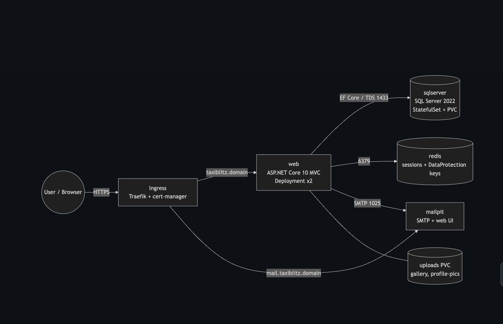{width=70%}

# 3. Git и јавен репозиториум

Оригиналниот репозиториум е приватен, бидејќи е поврзан со продукциската инсталација на Azure. За проектот креирав **нов јавен репозиториум со чиста историја** (`edirizvani/taxiblitz-kiii`), во кој е копиран изворниот код без чувствителни податоци: отстранети се commit-нати Data Protection клучеви, лозинката и личната е-пошта се заменети со примерни вредности, `.env` и тајните се во `.gitignore`, а пред push репозиториумот се скенира со **gitleaks**.

Работам со гранки: `main` (стабилна верзија), `dev` (интеграција) и feature гранки (`feature/containerize`, `feature/ci-pipeline`, …). Секоја промена влегува преку Pull Request, прво во `dev`, а потоа во `main`. За пораките на commit-ите користам *Conventional Commits* (`feat:`, `build:`, `ci:`, `docs:`).

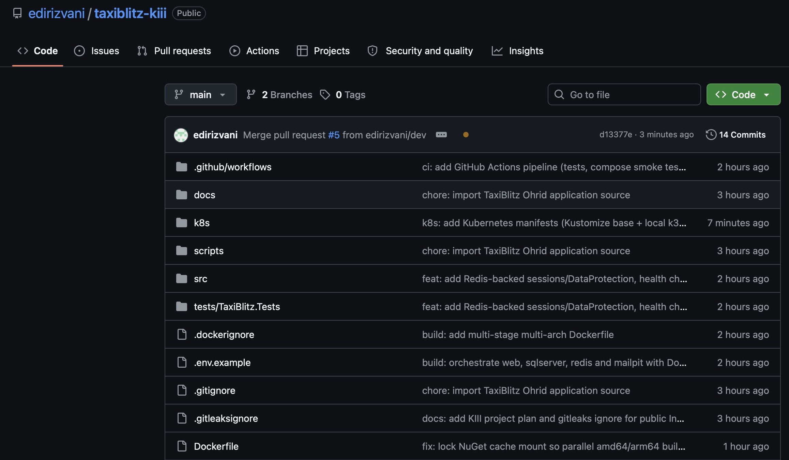{width=60%}

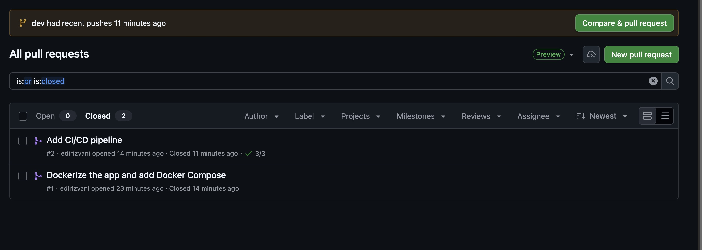{width=60%}

# 4. Докеризација

Имиџот се гради со **multi-stage Dockerfile** во корен на репозиториумот:

**1. Build фаза** (`mcr.microsoft.com/dotnet/sdk:10.0`)

- Прво се копираат само `.csproj` датотеките и се извршува `dotnet restore`. Така NuGet слојот останува кеширан сè додека не се смени некоја зависност.
- Потоа се копира изворниот код и се извршува `dotnet publish -c Release`.
- Фазата работи на архитектурата на машината што гради (`--platform=$BUILDPLATFORM`) и крос-компајлира за целната архитектура (`-a $TARGETARCH`). Така истиот Dockerfile брзо гради имиџи и за **linux/amd64** (сервери, CI) и за **linux/arm64** (Apple Silicon), без бавна емулација на SDK-то.
- NuGet пакетите се чуваат во BuildKit cache mount (`--mount=type=cache`).

**2. Runtime фаза** (`mcr.microsoft.com/dotnet/aspnet:10.0`)

- Содржи само runtime и објавената апликација, без SDK и изворен код.
- Апликацијата работи како **non-root** корисник (`USER $APP_UID`). Датотеките на апликацијата се во сопственост на root (само за читање), а до корисникот на апликацијата припаѓаат само папките каде таа запишува (`wwwroot/gallery`, `wwwroot/profile-pics`).
- `HEALTHCHECK` го проверува `/health/live` ендпоинтот.
- OCI labels (`version`, `revision`, `source`) преку `ARG VERSION` и `ARG GIT_SHA`, кои ги пополнува CI pipeline-от.

```dockerfile
FROM --platform=$BUILDPLATFORM mcr.microsoft.com/dotnet/sdk:10.0 AS build
ARG TARGETARCH
COPY src/*/*.csproj ...                       # само проектни датотеки
RUN dotnet restore src/TaxiBlitz.Web/TaxiBlitz.Web.csproj -a $TARGETARCH
COPY src/ src/
RUN dotnet publish ... -c Release -a $TARGETARCH --no-restore -o /app/publish

FROM mcr.microsoft.com/dotnet/aspnet:10.0 AS runtime
COPY --from=build /app/publish .
USER $APP_UID
HEALTHCHECK CMD curl -fsS http://localhost:8080/health/live || exit 1
ENTRYPOINT ["dotnet", "TaxiBlitz.Web.dll"]
```

Со `.dockerignore` од контекстот се исклучени `bin/`, `obj/`, тестовите, документацијата, `.env` и клучевите, така што во имиџот не може да заврши тајна.

**Промени во апликацијата за работа во контејнер:**

- **Health checks:** `/health/live` (процесот работи) и `/health/ready` (достапни се базата и Redis). Ги користат Docker, Docker Compose и Kubernetes probes.
- **Redis (опционално, преку конфигурација):** ако е поставено `Redis__ConnectionString`, Data Protection клучевите и сесиите се чуваат во Redis. Без оваа поставка апликацијата работи како порано, па тестовите и Azure продукцијата не се засегнати.
- **SMTP TLS преку конфигурација** (`SmtpEnableSsl`), бидејќи Mailpit користи обичен SMTP.
- **Reverse proxy поддршка** преку `ASPNETCORE_FORWARDEDHEADERS_ENABLED`, за HTTPS пренасочувањата и колачињата да работат зад Ingress контролерот.
- Додаден е интеграциски тест за health ендпоинтите.

{width=70%}

# 5. Оркестрација со Docker Compose

`docker-compose.yml` ги дефинира сите четири сервиси:

- **Изолирани мрежи:** `frontend` (web и Mailpit UI, достапни од хостот) и `backend` со `internal: true` (web, sqlserver, redis, SMTP), така што базата и Redis немаат пристап надвор и не се изложени на хостот.
- **Редослед на стартување според здравјето:** `web` чека `sqlserver`, `redis` и `mailpit` да бидат *healthy* (`depends_on: condition: service_healthy`). SQL Server се проверува со `sqlcmd … SELECT 1`, Redis со `redis-cli ping`, Mailpit со `readyz`, а web со `/health/ready`.
- **Перзистентност:** именувани волумени за базата (`mssql-data`), Redis (`redis-data`, AOF) и прикачените слики (`uploads-gallery`, `uploads-profile`).
- **Ресурси:** лимити за CPU и меморија за секој сервис, `restart: unless-stopped`.
- **Конфигурација:** сите лозинки доаѓаат од `.env` (не е во git). `.env.example` ги документира сите променливи, а `${SA_PASSWORD:?…}` го прекинува стартувањето ако лозинката не е поставена.
- **`docker-compose.override.yml`** (автоматски се вчитува локално) ја изложува базата на порта 14333 за алатки како Azure Data Studio.
- SQL Server има `platform: linux/amd64`, бидејќи Microsoft објавува само amd64 имиџ. На Apple Silicon тој работи преку Rosetta емулација.

```bash
cp .env.example .env          # поставување лозинки
docker compose up -d --build  # градење и стартување
docker compose ps             # сите сервиси: healthy
```

Проверено е дека регистрацијата на корисник испраќа е-пошта за потврда до Mailpit, дека клучевите се запишуваат во Redis и дека податоците остануваат по `docker compose down` / `up`.

{width=70%}

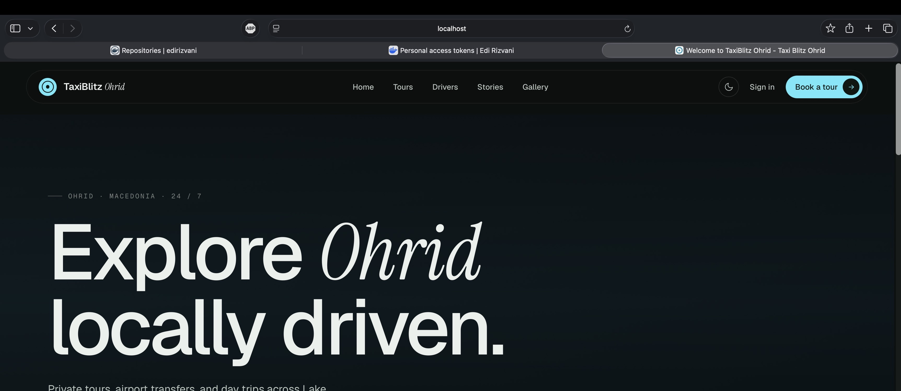{width=60%}

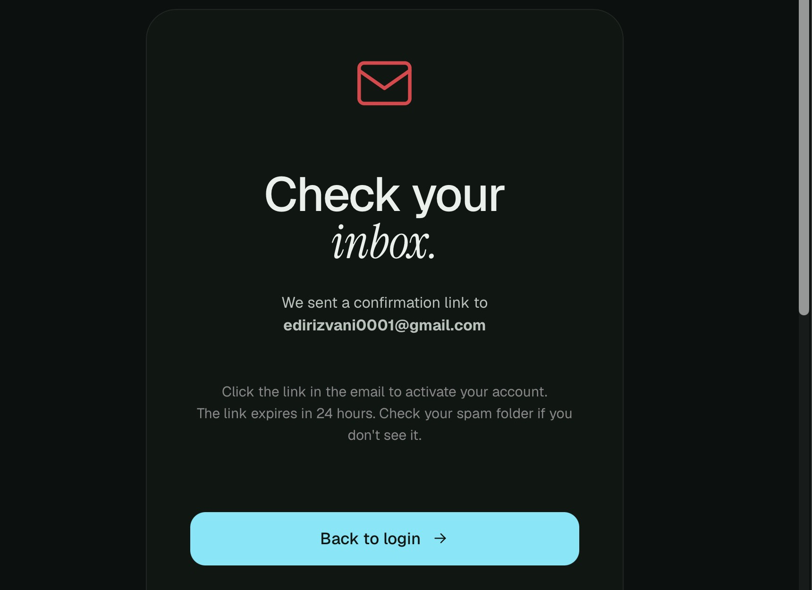{width=34%} 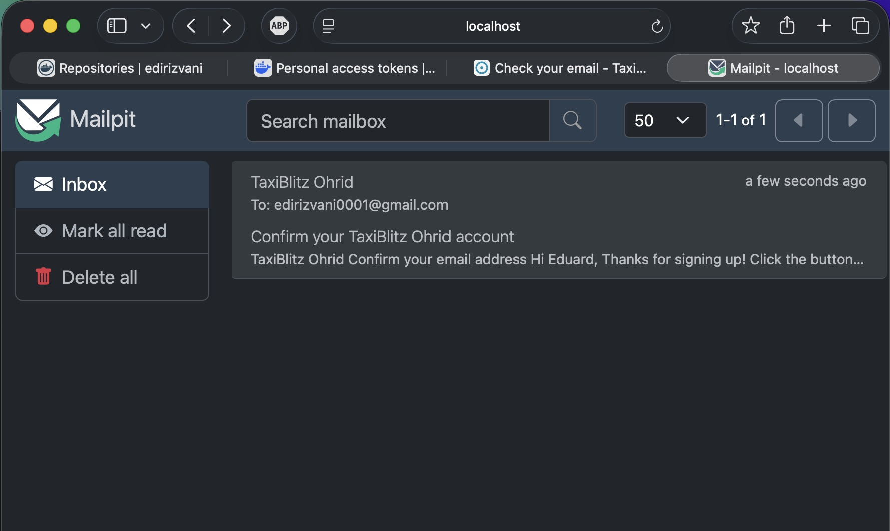{width=50%}

*Слика 7: По регистрација апликацијата испраќа е-пошта за потврда (лево), која пристигнува во Mailpit (десно)*

# 6. CI/CD pipeline со GitHub Actions

За CI платформа избрав **GitHub Actions** (`.github/workflows/ci-cd.yml`). Pipeline-от (слика 8) се активира при push на `main`/`dev`, при верзиски tag `v*.*.*`, при Pull Request кон `main`/`dev` и рачно (`workflow_dispatch`). Се состои од четири job-а:

| Job | Кога | Што прави |
|---|---|---|
| **Build & test** | секој push / PR | .NET 10 restore (со NuGet кеш), build во Release, извршување на сите xUnit тестови, табела со резултати во summary и TRX датотека како artifact |
| **Docker Compose smoke test** | секој push / PR | го гради имиџот, го стартува целиот stack со `docker compose up --wait` и проверува `/health/ready`, почетната страна, `/Tours` и Mailpit |
| **Build & push image** | само push (по успешни тестови) | multi-arch build (amd64 + arm64) со Buildx и QEMU, автоматско означување на верзии, push на Docker Hub, SBOM и provenance attestation, Trivy скен за ранливости |
| **Deploy (GitOps)** | само push на `main` | го запишува новиот tag во `k8s/overlays/local` и прави commit — Argo CD го распоредува (поглавје 8) |

**Означување на верзии** (`docker/metadata-action`):

- `sha-<краток хаш>` — секој build е следлив до точен commit,
- `dev` / `main` — последната верзија од гранката,
- `latest` — само од `main`,
- `1.2.3` и `1.2` — при git tag `v1.2.3`.

**Тајни:** корисничкото име за Docker Hub е repository *variable*, а пристапниот токен е *secret* (`DOCKERHUB_TOKEN`), кој никогаш не се појавува во кодот или логовите. Build кешот се чува во GitHub Actions cache (`type=gha`), па повторните build-ови се значително побрзи.

Со секој push на git автоматски се објавува нова верзија на Docker имиџот на Docker Hub.

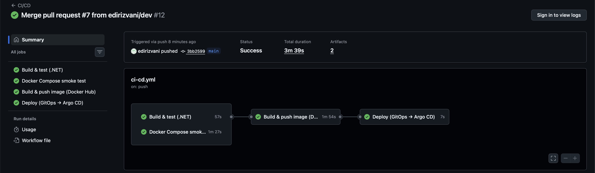{width=80%}

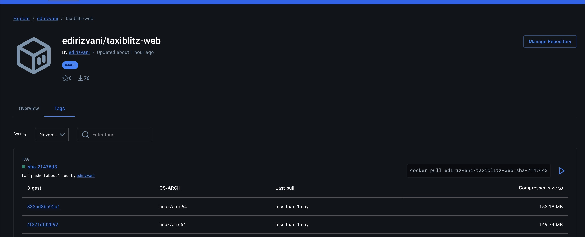{width=70%}

# 7. Kubernetes

Манифестите се во папката `k8s/` и се организирани со **Kustomize** во две нивоа:

- `k8s/base/` — манифести кои не зависат од околината (по еден директориум за web, mssql, redis, mailpit и ingress),
- `k8s/overlays/local/` — локалната околина: вистинските hostnames за Ingress и tag-от на имиџот. Истиот overlay го користи и Argo CD (поглавје 8).

Сите ресурси се во посебниот namespace **`taxiblitz`**. Кластерот е **k3s**, стартуван локално со **k3d**, со 1 server и 1 agent јазол. Тој користи Traefik како Ingress контролер и `local-path` за перзистентно складирање.

```bash
k3d cluster create taxiblitz --agents 1 -p "80:80@loadbalancer" -p "443:443@loadbalancer"
kubectl apply -k k8s/overlays/local
```

Бидејќи SQL Server објавува само amd64 имиџ, пред да го изберам кластерот проверив дека работи во k3d на ARM (Apple Silicon) преку Rosetta емулација. Тестот беше успешен.

## 7.1 Deployment за апликацијата (со ConfigMap и Secret)

- **ConfigMap `web-config`:** не-тајна конфигурација која се внесува како environment променливи (`envFrom`) — `ASPNETCORE_ENVIRONMENT=Production`, `ASPNETCORE_FORWARDEDHEADERS_ENABLED`, адреса на Redis, SMTP host/port, admin е-пошта и нивоа на логирање.
- **Secret `web-secret`:** connection string кон базата, лозинка за admin, SMTP акредитиви и API клучеви. Во репозиториумот е само `secret.demo.yaml` со демо вредности. За вистинска околина Secret-от се креира надвор од git.
- **Deployment `taxiblitz-web`:**
  - `replicas: 2` и `RollingUpdate` (`maxSurge: 1`, `maxUnavailable: 0`), што значи ажурирање без прекин,
  - два **init container-а**: `wait-for-db` чека SQL Server да прифаќа конекции, а `seed-uploads` еднаш ги копира сликите од имиџот во волуменот за прикачени датотеки,
  - проби: `startupProbe` (`/health/live`, до 150 s за миграциите при прво стартување), `readinessProbe` (`/health/ready` — базата и Redis) и `livenessProbe` (`/health/live`),
  - безбедност: `runAsNonRoot`, `readOnlyRootFilesystem`, `allowPrivilegeEscalation: false`, без Linux capabilities и `seccompProfile: RuntimeDefault`,
  - PVC `web-uploads` монтиран со `subPath` на `wwwroot/gallery` и `wwwroot/profile-pics`. Бидејќи `local-path` волумените се ReadWriteOnce, `podAffinity` ги држи репликите на ист јазол,
  - **HorizontalPodAutoscaler** (2–4 реплики при 70% CPU) и **PodDisruptionBudget** (`minAvailable: 1`).

Миграциите на базата ги извршува самата апликација при стартување. EF Core 10 користи заклучување на базата (`sp_getapplock`), па двете реплики не можат истовремено да ги извршат миграциите.

## 7.2 Service

`taxiblitz-web` е од тип **ClusterIP**, порта 80 → именуваната порта `http` (8080) на подовите. Ги избира подовите преку `app.kubernetes.io/name: taxiblitz-web` и го распределува сообраќајот меѓу двете реплики. Истиот принцип важи и за `redis` (6379) и `mailpit` (1025 SMTP, 8025 HTTP).

## 7.3 Ingress

Ingress ресурсот користи `ingressClassName: traefik` и **правила по host**:

- `taxiblitz.127.0.0.1.nip.io` → `taxiblitz-web:80`
- `mail.127.0.0.1.nip.io` → `mailpit:8025`

`*.127.0.0.1.nip.io` преку јавен DNS се разрешува во 127.0.0.1, па не е потребно менување на `/etc/hosts`. Во base манифестот hostnames се placeholder-и, а overlay-от ги заменува со JSON patch. Traefik го терминира HTTPS со својот вграден сертификат.

Преку annotation се поврзани две **Traefik Middleware** ресурси: `redirect-https` (HTTP → HTTPS, 301) и `security-headers` (`X-Frame-Options`, `X-Content-Type-Options`, `Referrer-Policy`). Апликацијата работи во Production режим (Secure колачиња), а преку forwarded headers знае дека оригиналното барање е HTTPS.

## 7.4 StatefulSet за базата (со ConfigMap и Secret)

- **ConfigMap `mssql-config`:** `ACCEPT_EULA`, `MSSQL_PID`, `MSSQL_COLLATION` и датотеката `mssql.conf` (ограничување на меморијата на 2 GB), монтирана со `subPath` во `/var/opt/mssql/mssql.conf`.
- **Secret `mssql-secret`:** `MSSQL_SA_PASSWORD`, внесен преку `secretKeyRef`.
- **Headless Service `mssql`** (`clusterIP: None`) дава стабилно DNS име `mssql-0.mssql`, кое го користи connection string-от на апликацијата.
- **StatefulSet `mssql`:** `volumeClaimTemplates` (PVC `data-mssql-0`, 10Gi), корисник и `fsGroup` 10001 (`mssql`), `startupProbe` / `livenessProbe` (TCP 1433) и `readinessProbe` (`sqlcmd … SELECT 1`), ресурси 2–3 GiB меморија и `terminationGracePeriodSeconds: 60` за безбедно гасење.

## 7.5 Мрежна изолација

Два **NetworkPolicy** ресурси дозволуваат пристап до SQL Server (1433) и Redis (6379) **само од подовите на апликацијата**. Проверено е дека друг под во истиот namespace не може да се поврзе со нив.

## 7.6 Распоредување и демонстрација

```bash
kubectl apply -k k8s/overlays/local
kubectl -n taxiblitz get all,pvc,ingress
```

Демонстрирано е:

1. сите подови се во статус *Running/Ready* во namespace-от `taxiblitz`,
2. апликацијата е достапна на https://taxiblitz.127.0.0.1.nip.io, а HTTP се пренасочува кон HTTPS,
3. регистрацијата преку Ingress испраќа е-пошта за потврда до Mailpit (https://mail.127.0.0.1.nip.io),
4. по `kubectl delete pod mssql-0` StatefulSet-от го креира истиот под повторно, со истиот PVC. Корисниците останаа во базата, а сајтот продолжи да работи,
5. NetworkPolicy го блокира пристапот до базата од под кој не е дел од апликацијата.

{width=80%}

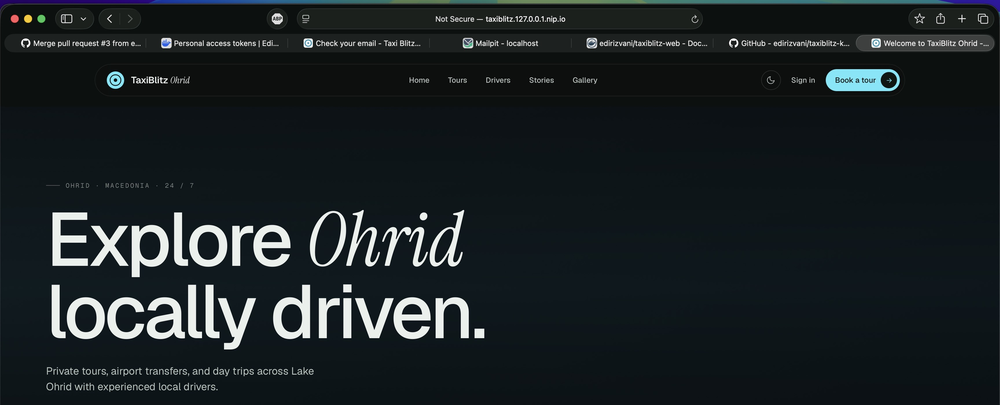{width=60%}

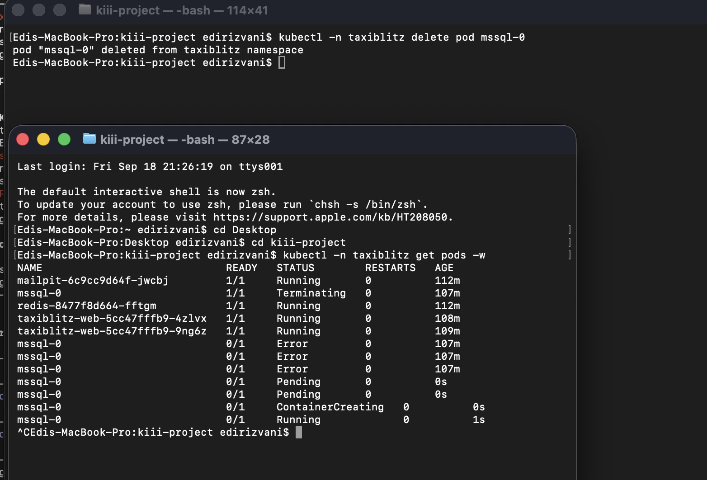{width=46%} 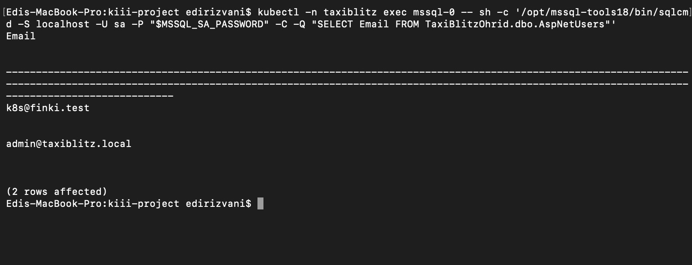{width=48%}

*Слика 12: Бришење на подот `mssql-0`: StatefulSet-от го креира повторно (лево), а податоците остануваат зачувани во PVC-то (десно)*

# 8. Бонус: Continuous Deployment со Argo CD

Pipeline-от е проширен со CD дел според **GitOps** пристапот. Git е единствениот извор на вистина за состојбата на кластерот:

1. **Argo CD** (v3.5) е инсталиран во кластерот, во namespace-от `argocd` (`argocd/install.sh`). UI-то е достапно преку Traefik Ingress на https://argocd.127.0.0.1.nip.io.
2. Ресурсот **Application** (`argocd/application.yaml`) ја следи патеката `k8s/overlays/local` на гранката `main`. Користи `syncPolicy.automated` со `prune` (ги брише ресурсите отстранети од git) и `selfHeal` (ги враќа рачните измени во кластерот), како и `ServerSideApply` / `ServerSideDiff`.
3. Во CI pipeline-от е додаден четврти job, **Deploy (GitOps → Argo CD)**. Тој се извршува само при push на `main`, по успешен build и push на имиџот. Job-от го запишува новиот tag (`sha-<хаш>`) во `k8s/overlays/local/kustomization.yaml` и прави commit со `[skip ci]`.
4. Argo CD го забележува новиот commit, ги генерира манифестите со Kustomize и прави **rolling update** на Deployment-от (`maxUnavailable: 0`, без прекин).

Предност на овој пристап е што GitHub Actions **нема пристап до кластерот** (нема kubeconfig во тајните). Кластерот сам ја влече желената состојба од git, а секое распоредување е commit кој може да се врати со `git revert`.

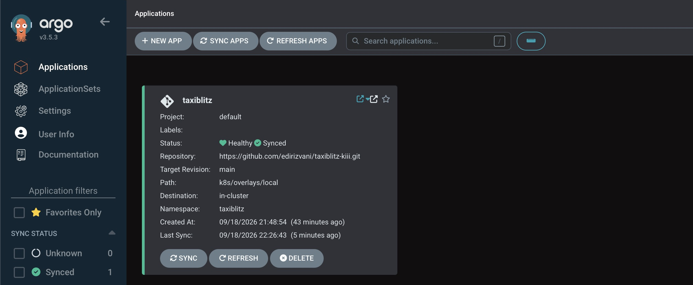{width=75%}

# 9. Проблеми и решенија

| Проблем | Решение |
|---|---|
| Argo CD прикажуваше лажни разлики кај StatefulSet (полиња кои ги додава API серверот) | `ServerSideDiff=true` и `ServerSideApply=true` во Application-от |
| Со повеќе реплики корисниците се одјавуваа (секоја реплика имаше свои Data Protection клучеви) | Клучевите и сесиите се преместени во Redis |
| SQL Server има само amd64 имиџ, а развојниот компјутер е ARM (Apple Silicon) | `platform: linux/amd64` во Compose (Rosetta); multi-arch имиџ за апликацијата; кластер на amd64 машина |
| Регистрацијата бара потврда на е-пошта, а во демо нема Gmail | Mailpit како SMTP сервис; TLS за SMTP е конфигурабилен |
| Во приватниот репозиториум имаше лозинка и клучеви | Нов јавен репозиториум со чиста историја, gitleaks скенирање, тајни само во `.env` / GitHub Secrets / Kubernetes Secrets |
| Во CI паралелниот build за amd64 и arm64 паѓаше при `dotnet restore` (двата build-а истовремено запишуваа во истиот NuGet кеш) | Cache mount со `sharing=locked`, за build-овите да го користат кешот наизменично |
| Зад Ingress апликацијата не знаеше дека барањето е HTTPS | Forwarded headers (`X-Forwarded-Proto`) |
| Апликацијата не смее да стартува пред базата да е спремна | Health checks + `depends_on: service_healthy` во Compose, readiness/startup probes во Kubernetes |

# 10. Заклучок

Апликацијата TaxiBlitz Ohrid е целосно докеризирана и оркестрирана со Docker Compose. Секоја промена поминува низ автоматизиран CI/CD pipeline — тестови, smoke тест на контејнерите, multi-arch build и објава на Docker Hub. Апликацијата работи на Kubernetes во посебен namespace со Deployment, Service, Ingress и StatefulSet за базата, а новите верзии автоматски се распоредуваат со Argo CD.

Преку проектот ги применив концептите од предметот врз реална продукциска апликација, при што се појавија и практични проблеми (споделување клучеви меѓу реплики, архитектура на процесорот, reverse proxy). Нивните решенија се дел од конечната конфигурација.

**Линкови**

- Изворен код: https://github.com/edirizvani/taxiblitz-kiii
- Docker имиџ: https://hub.docker.com/r/edirizvani/taxiblitz-web
- Апликација на Kubernetes (локално): https://taxiblitz.127.0.0.1.nip.io
